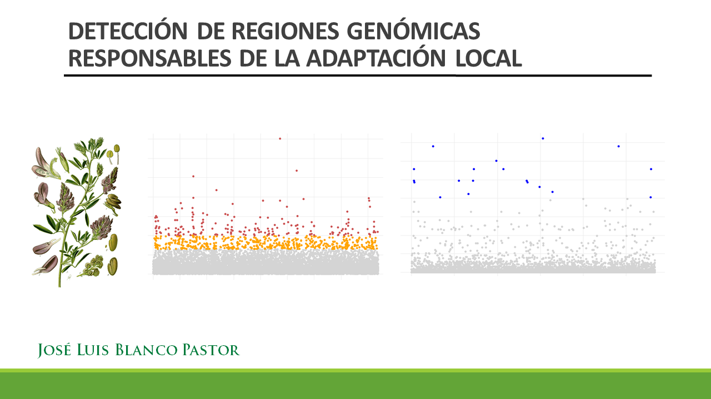

### DETECCIÓN DE REGIONES GENÓMICAS RESPONSABLES DE LA ADAPTACIÓN LOCAL

Slides and R Notebook code for workshop course (3 hours) on GEAs in R. 

Slides: https://github.com/jlblancopastor/GEA_workshop/blob/main/Workshop_adaptacion_local.pdf

José Luis Blanco Pastor  
https://jlblancopastor.net

Twitter: @jlblancopastor

