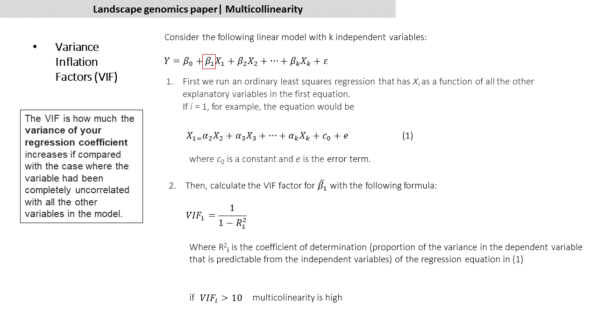
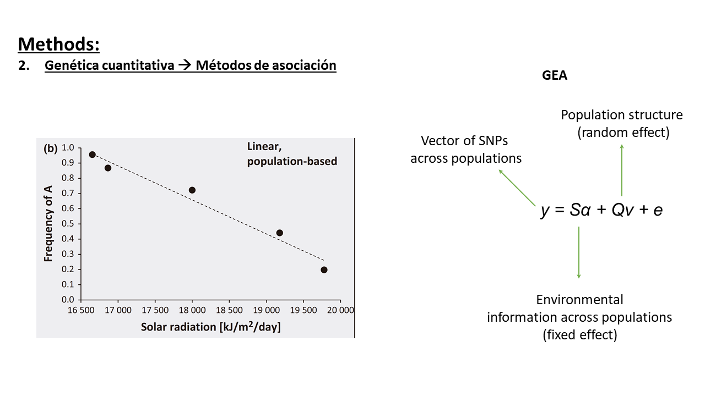
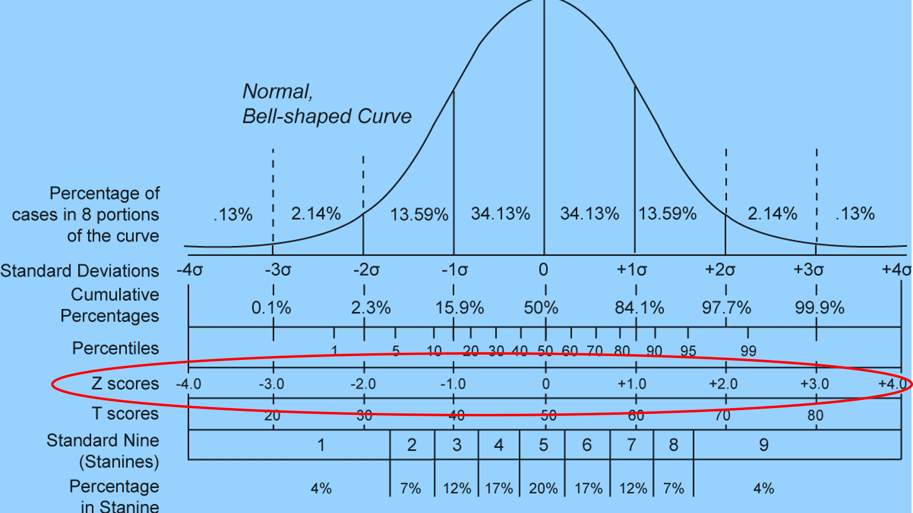
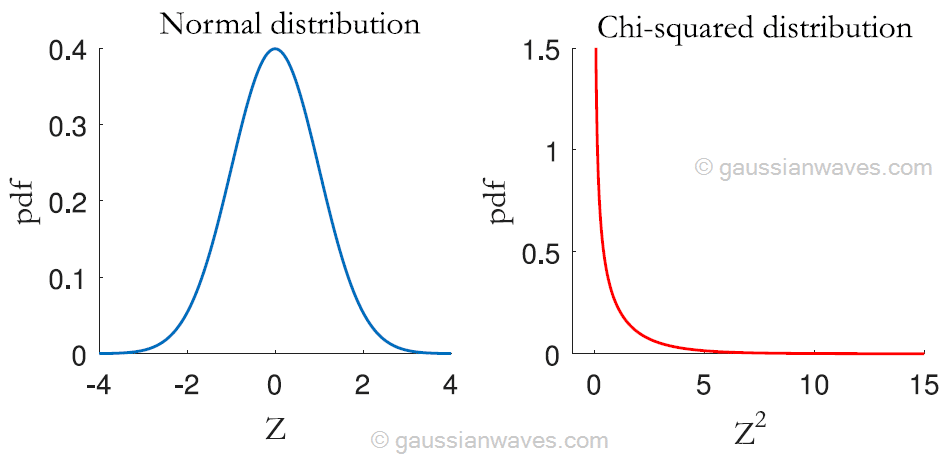

#Options
```{r options and packages, include=FALSE}

options(scipen = 999) # Removes scientific notation

#install.packages(knitr, )
library(knitr)
library(adegenet)
library(varhandle)
library(stringr)
library(data.table)
library(conStruct)
library(psych)
library(vegan)
library(robust)
library(ggplot2)
library(cowplot)
library(lfmm)
library(gplots)
library(raster)

# if (!requireNamespace("BiocManager", quietly = TRUE))
#     install.packages("BiocManager")
# 
# BiocManager::install("qvalue")
library(qvalue)


```

# *M.sativa*
# Load dataset (available at https://onlinelibrary.wiley.com/doi/full/10.1111/mec.16061)

```{r Load datasets}
#Running time ~ 30s

snps_sativa <- read.PLINK(file = "data/Msativa_SNP_data_Blanco_Pastor_2021.raw",
                   map.file="data/Msativa_SNP_data_Blanco_Pastor_2021.map", parallel = F) 
snps_sativa_mat <- as.matrix(snps_sativa)
rownames(snps_sativa_mat) <- gsub("^X", "", rownames(snps_sativa_mat))
```

# Data cleaning
```{r Data cleaning}
#Running time ~5s

#Transform to numeric
snps_sativa_mat <- unfactor(as.data.frame(snps_sativa_mat))

#Leave in populations with <=50% missing data
delete.na <- function(df, n) {
  df[rowSums(is.na(df)) <= n,] #Populations in rows
}

snps_sativa_mat_50md <- delete.na(snps_sativa_mat, n= length(colnames(snps_sativa_mat))*0.5)

```

#Transform individual genotypes to population genotypes
```{r}
#Running time ~1m

##Allele frequency data

#Specify a matrix of allele frequency data for your samples
snps_sativa_mat_50md_mat <- as.matrix(snps_sativa_mat_50md)

#Pick an allele to count across all samples (remind that it is coded to 0 1 2, being 1 heterozygous genotype)
#Here we pick the alternative allele
#The frequency of the counted allele at a locus in a sample is the number of times the counted allele is observed at a locus divided by the number of **chromosomes** genotyped in that sample

as.data.frame(snps_sativa_mat_50md_mat[1:5,1:5])
snps_sativa_mat_50md_mat[snps_sativa_mat_50md_mat==1] <- 0.5 #Heterozygous
snps_sativa_mat_50md_mat[snps_sativa_mat_50md_mat==0] <- 1 #Alternative allele (we quantify this)
snps_sativa_mat_50md_mat[snps_sativa_mat_50md_mat==2] <- 0 #Reference allele
as.data.frame(snps_sativa_mat_50md_mat[1:5,1:5])

#A sample can consist of a single individual or multiple individuals lumped together
#We transform the Msativa dataset from individual sample to population sample
snps_sativa_mat_50md_mat <- as.data.frame(snps_sativa_mat_50md_mat)
snps_sativa_mat_50md_mat$pop <- str_extract(rownames(snps_sativa_mat_50md_mat), ".*(?=_.)") #We extract population codes

#merge individuals into populations
snps_sativa_mat_50md_mat_dt <- as.data.table(snps_sativa_mat_50md_mat)
setkey(snps_sativa_mat_50md_mat_dt, pop) #Show population codes in ascending order
snps_sativa_mat_50md_mat_dt_pop <- snps_sativa_mat_50md_mat_dt[, lapply(.SD,mean, na.rm =T), by=pop] #.SD means (subsets of data.table), in this case defined by "pop".
as.data.frame(snps_sativa_mat_50md_mat_dt_pop[1:5,1:10])
```

#Impute missing data
```{r}
#Running time ~1s

#Data formatting
snps_sativa_mat_50md_mat_dt_pop <- as.data.frame(snps_sativa_mat_50md_mat_dt_pop)
row.names(snps_sativa_mat_50md_mat_dt_pop) <- snps_sativa_mat_50md_mat_dt_pop$pop
snps_sativa_mat_50md_mat_dt_pop$pop <- NULL

snps_sativa_mat_50md_mat_dt_pop_mat <- as.matrix(as.data.frame(snps_sativa_mat_50md_mat_dt_pop))

#Impute missing data with mean values across populations
snps_sativa_mat_50md_mat_dt_pop_mat_imputed <- snps_sativa_mat_50md_mat_dt_pop_mat
for(i in 1:ncol(snps_sativa_mat_50md_mat_dt_pop_mat_imputed)){
  snps_sativa_mat_50md_mat_dt_pop_mat_imputed[is.na(snps_sativa_mat_50md_mat_dt_pop_mat_imputed[,i]), i] <- mean(snps_sativa_mat_50md_mat_dt_pop_mat_imputed[,i], na.rm = TRUE)
}
```

#Genetic structure
```{r}
#Running time ~20s

#**Model free** clustering procedure used in Discriminant Analysis of Principal Components (DAPC, Jombart et al. 2010).
#k-means, a very popular **Machine Learning clustering algorithm** which finds a given number of K groups maximizing the variation between groups.

fc <- find.clusters(snps_sativa_mat_50md_mat_dt_pop_mat_imputed, n.pca= 99, n.clust = NULL, choose.n.clust= FALSE, criterion= "diffNgroup", n.iter= 1E4, n.start= 100, center=TRUE, scale=FALSE) #  If n.clust left as NULL, several K-means are run for a range of k (number of clusters) values.
```

```{r}
#Running time ~10s

#DAPC function (Discriminant Analysis of Principal Components), first transforms the data using PCA, and then performs a Discriminant Analysis on the Retained principal components, using clusters as the discriminating variable. Based on the retained discriminant functions it allows to compute allele contributions to genetic clusters and therefore provides membership probabilities of each population for the diferent K groups.

dapc1 <- dapc(snps_sativa_mat_50md_mat_dt_pop_mat_imputed, fc$grp, n.pca = 99, n.da=4)

mycol <- c("#CC3399", "#FFCC00")

scatter(dapc1, scree.da=TRUE, bg="white", pch=20, cell=0, cstar=0, col=mycol, solid=.4,
        cex=1.5,clab=0, leg=TRUE, txt.leg=paste("Cluster",1:2),posi.da="bottomright",  ratio.da = 0.18, cleg = 0.9)


#Individual's membership to clusters
compoplot(dapc1, posi="bottomright",
          txt.leg=paste("Cluster", 1:2), lab="",
          ncol=1, xlab="populations", col=mycol)

```

##Geographic sampling coordinates
```{r} 
#Running time ~1s

Msativa_coordinates <-read.csv2("data/Medicago_sativa_samples.csv", header =T, as.is=T, dec=",", sep=";", check.names = T)
Msativa_coordinates$accessionN_SampleN <- str_extract(Msativa_coordinates$accessionN_SampleN, ".*(?=_.)")

Msativa_coordinates <- Msativa_coordinates[Msativa_coordinates$accessionN_SampleN %in% rownames(snps_sativa_mat_50md_mat_dt_pop),3:4]
```

## Pie plot on a map
```{r} 
#Running time ~5s

# make the desired map
    maps::map(xlim = range(Msativa_coordinates[,1]) + c(-30,5), ylim = range(Msativa_coordinates[,2])+c(-15,5), col="gray99", fill = T, bg = "deepskyblue1")

# add the pie plot
    make.admix.pie.plot(admix.proportions = dapc1$posterior,
                        coords = Msativa_coordinates,
                        add = T,
                        radii = 1,
                        layer.colors = mycol)

    
```

Yellow: M. sativa ssp. falcata (cold adapted)
Purple: M. sativa ssp. caerulea (drought adapted)

# RDA
## Raster data
```{r}
#Data below takes around 30 min to download. We will load a .rds file instead.

#Running time ~30s

# raster_data <- list.files(path = "E:/Work data/Analyses/2016/2016_01_15_AlfalfaLandscapeGenetics/R/data/crop", pattern="\\.grd$", full.names=TRUE) #36GB in raster data
# 
# # Create a collection of layers with 'STACK'
# stack_raster <- stack(raster_data)
# 
# #Extract information from populations GPS positions
# loc <- Msativa_coordinates[,c("lon", "lat")]
# ext <- raster::extract(stack_raster, loc)
# Msativa_env_data <- cbind(Msativa_coordinates, ext)

# saveRDS(Msativa_env_data, file = "data/Msativa_env_data.rds")
Msativa_env_data <- readRDS("data/Msativa_env_data.rds")
```

RDA requires complete data frames (i.e., no missing data). We imputed missing values using the mean value at each environmental variable across all individuals.
```{r Impute_missing_data4}
#Running time ~5s

Msativa_env_data_imputed <- Msativa_env_data
rownames(Msativa_env_data_imputed) <- Msativa_env_data_imputed$accessionN_SampleN

Msativa_env_data_imputed  <- Msativa_env_data_imputed[,3:57]

#Impute missing data with mean values across populations
for(i in 1:ncol(Msativa_env_data_imputed)){
  Msativa_env_data_imputed[is.na(Msativa_env_data_imputed[,i]), i] <- mean(Msativa_env_data_imputed[,i], na.rm = TRUE)
}
```

##Environmental variables check
###Correlation matrix
```{r fig.height=32, fig.width=32}
#Running time ~10s

pdf("data/pairs_panels.pdf",width=32,height=32, paper='special')
pairs.panels(Msativa_env_data_imputed, scale=T, method="spearman")
dev.off()
```
###VIF

image: 

```{r}
#Running time ~10s

#The RDA analysis with **ALL VARIABLES** and VIF calculation

# Msativa
rda_bioclim_Msat<-rda(snps_sativa_mat_50md_mat_dt_pop_mat_imputed, Msativa_env_data_imputed, scale=T)

rda_bioclim_Msat

print("VIF")
vif.cca(rda_bioclim_Msat)
```
Problems with VIF: 
-Almost all variables with VIF>10 when many variables are considered
-Discourages synthetic variables (variable resumen)

###Proposed variable reduction strategy
```{r, fig.height=16, fig.width=16}
#Running time ~2s

# Our protocol for variable reduction proceeded as follows: 
# First, we performed cluster analyses of factors according to a matrix of absolute correlation values |r|.

#Cluster analysis 1
vcor <- cor(Msativa_env_data_imputed)
vdist<-abs(as.dist(vcor))
vcluster<-hclust(1-vdist, method = "complete")
par(cex=0.8)
plot(vcluster, main = "Msativa")
abline(h=0.3, col="red")

Msativa_env_data_imputed2 <- Msativa_env_data_imputed[,c("CRU_FRS", "CRU_PET", "CRU_PRE", "CRU_VAP", "DAAC_AWC_CLASS", "DAAC_BD", "DAAC_DUNNE", "DAAC_FC", "DAAC_S_GRAVEL", "DAAC_S_OC", "DAAC_S_PH_H2O", "DAAC_S_SAND", "DAAC_SMBC", "DAAC_SPD", "DAAC_T_CEC_CLAY", "DAAC_T_CLAY", "DAAC_T_GRAVEL", "DAAC_T_PH_H2O", "DAAC_T_SILT", "DAAC_TND", "WC_BIO10","WC_BIO12", "WC_BIO14", "WC_BIO3", "WC_BIO4", "WC_BIO5", "WC_BIO6", "WC_BIO8", "WC_BIO9")]

#Cluster analysis 2
vcor <- cor(Msativa_env_data_imputed2)
vdist<-abs(as.dist(vcor))
vcluster<-hclust(1-vdist, method = "complete")
par(cex=0.8)
plot(vcluster, main = "Msativa")
abline(h=0.3, col="red")
 
 Msativa_env_data_imputed3 <- Msativa_env_data_imputed2[,c("CRU_PET", "CRU_PRE", "DAAC_AWC_CLASS", "DAAC_BD", "DAAC_DUNNE", "DAAC_FC", "DAAC_S_GRAVEL", "DAAC_S_PH_H2O", "DAAC_SMBC", "DAAC_SPD", "DAAC_T_CEC_CLAY", "DAAC_T_CLAY" , "DAAC_T_PH_H2O", "DAAC_T_SILT", "DAAC_TND", "WC_BIO14", "WC_BIO3", "WC_BIO5", "WC_BIO6", "WC_BIO8")]
 
#Cluster analysis 3
vcor <- cor(Msativa_env_data_imputed3)
vdist<-abs(as.dist(vcor))
vcluster<-hclust(1-vdist, method = "complete")
par(cex=0.8)
plot(vcluster, main = "Msativa")
abline(h=0.3, col="red")
```
 After subsequent cluster analyses, we retained one variable in clusters with distance among variables lower than 0.3 (correlation higher than 0.7). We favoured temperature variables over precipitation or radiation variables, monthly over quarterly climatic variables and topsoil over subsoil variables. After a preliminary RDA analysis, we also checked for multicollinearity using variance inflation factors (VIF) and confirmed that VIF of selected variables was <10.

##RDA bioclim
```{r}
#Running time ~5s

#The RDA analysis (bioclimatic data)

# Msativa
rda_bioclim_Msat<-rda(snps_sativa_mat_50md_mat_dt_pop_mat_imputed ~ CRU_PET + CRU_PRE +  WC_BIO14 + WC_BIO3 + WC_BIO5 + WC_BIO6 + WC_BIO8, 
         Msativa_env_data_imputed3, scale=T)

rda_bioclim_Msat

print("VIF")
vif.cca(rda_bioclim_Msat)
```

##The RDA plot
Axes are composite variables that represent genetic data constrained by their association with environmental data.
```{r}

#Running time ~5s

admix.props_Msat_plot <- dapc1$posterior
colnames(admix.props_Msat_plot) <- c("caerulea", "falcata")
admix.props_Msat_plot <- as.data.frame(admix.props_Msat_plot)
admix.props_Msat_plot$cluster_membership <- colnames(admix.props_Msat_plot)[apply(admix.props_Msat_plot,1,which.max)]

colorby <- admix.props_Msat_plot$cluster_membership
colorby <- as.factor(colorby)

bg <- c("#CC3399", "#FFCC00") # colors of our clusters **according to the order of levels**

sel <- rownames(rda_bioclim_Msat$CCA$biplot)

# axes 1 & 2
plot(rda_bioclim_Msat, type="n")
points(rda_bioclim_Msat, display="species", pch=20, cex=0.7, col="gray32", scaling=3)               # the snps
points(rda_bioclim_Msat, display="sites", pch=21, cex=1.5, col="gray32", scaling=3, bg=bg[colorby]) # the populations
text(rda_bioclim_Msat, display = "bp", col="#0868ac", cex=1)                         # the predictors
legend("bottomright", legend = levels(colorby), bty = "n", col="gray32", pch = 21, cex=1.5, pt.bg = bg)

#SNPs only
# axes 1 & 2
plot(rda_bioclim_Msat, type="n", xlim=c(-1,1), ylim=c(-1,1),)
points(rda_bioclim_Msat, display="species", pch=20, cex=0.7, col="gray32", scaling=3)               # the snps
text(rda_bioclim_Msat, display = "bp", col="#0868ac", cex=1)                         # the predictors


```
Remember that axis represent a linear combination of genotipic variables constrained by environmental data.

Fig1 - Here we observe the populations as defined by their genetic variation associated with  environmental data.

Fig2 - Here we observe the SNPs as defined by their relationship with environmental data


This reflects a genome-wide pattern of isolation-by-environment (IBE) where clusters represent genetic groups with different niche breadth. **Finding outliers can be difficult under this patern**

## RDA: Identify candidate SNPs involved in local adaptation
```{r, message=FALSE}
#Running time ~1s

# The function returning p-values and q-values for all the loci

rdadapt<-function(rda,K)
{
  loadings<-rda$CCA$v[,1:as.numeric(K)]
  resscale <- apply(loadings, 2, scale)
  resmaha <- covRob(resscale, distance = TRUE, na.action= na.omit, estim="pairwiseGK")$dist
  lambda <- median(resmaha)/qchisq(0.5,df=K)
  reschi2test <- pchisq(resmaha/lambda,K,lower.tail=FALSE)
  qval <- qvalue(reschi2test)
  q.values_rdadapt<-qval$qvalues
  loci_names <- dimnames(rda$CCA$v)[[1]]
  return(data.frame(loci=loci_names, mahalanobisD = resmaha, p.values=reschi2test, q.values=q.values_rdadapt, stringsAsFactors = F))
}

# Using rdadapt function with K=7 (7 variables)
K <- 7
res_rdadapt_bioclim_Msat<-rdadapt(rda_bioclim_Msat, K)

```

##Manhattan plots
```{r, echo=TRUE, fig.align="center", fig.width=8, fig.height=4}
#Running time ~1s

# qvalue < 0.1
p1<- ggplot() +
  geom_point(aes(x=c(1:length(res_rdadapt_bioclim_Msat[,4])), y=-log10(res_rdadapt_bioclim_Msat[,4])), col = "gray83") +
  geom_point(aes(x=c(1:length(res_rdadapt_bioclim_Msat[,4]))[which(res_rdadapt_bioclim_Msat[,4] < 0.1)], y=-log10(res_rdadapt_bioclim_Msat[which(res_rdadapt_bioclim_Msat[,4] < 0.1),4])), col = "indianred3") +
  xlab("SNPs") + ylab("-log10(p.values)") +
  ggtitle("q-value < 0.1") +
  theme_bw()
p1
```

```{r, echo=TRUE, fig.align="center", fig.width=8, fig.height=4}
#Running time ~1s

# p-value < 0.01
p2<- ggplot() +
  geom_point(aes(x=c(1:length(res_rdadapt_bioclim_Msat[,3])), y=-log10(res_rdadapt_bioclim_Msat[,3])), col = "gray83") +
  geom_point(aes(x=c(1:length(res_rdadapt_bioclim_Msat[,3]))[which(res_rdadapt_bioclim_Msat[,3] < 0.05)], y=-log10(res_rdadapt_bioclim_Msat[which(res_rdadapt_bioclim_Msat[,3] < 0.05),3])), col = "orange") +
  geom_point(aes(x=c(1:length(res_rdadapt_bioclim_Msat[,3]))[which(res_rdadapt_bioclim_Msat[,3] < 0.01)], y=-log10(res_rdadapt_bioclim_Msat[which(res_rdadapt_bioclim_Msat[,3] < 0.01),3])), col = "indianred3") +
  xlab("SNPs") + ylab("-log10(p.values)") +
  ggtitle("p-value < 0.01") +
  theme_bw()
p2
```
```{r, message=FALSE}
#Running time ~1s

# Outliers loci (p-value < 0.01)
length(which(res_rdadapt_bioclim_Msat[,3] < 0.01))
```


#LFMM analyses
LFMMs are defined according to the following formula 
$$
 Y = X B^T + U V^T + E
$$
where $Y$ is the matrix of SNPs on individuals, $X$ is the matrix of explanatory (here environmental) variables , $B$ is a  matrix of effects for all explanatory variables, $U$ is a matrix of latent variables (i.e. population structure), and $V$ is a matrix of loadings for K latent variables.

This formula that uses matrices can be decomposed in uniresponse (SNP by SNP) multivariate linear regressions:
$$
y_{l} = x\beta_{l} + Ûv^T_{l} + e_{l}
$$
where $y_{l}$ is the SNP locus, $x$ is the environmental variable, $\beta_{l}$ is the effect of the environmental variable, $Û$ is a matrix defined by K latent variables (i.e. clusters) and v_{l} are their corresponding effect sizes.

This is a typical mixed model used in GEA methods (below the notation used in GWAS by Yu et al. 2006):


```{r}
#Running time ~1s

##scale environmental data [-1,1] (mean of 0 and sd of 1)
Msativa_env_data_imputed3_scale <- scale(Msativa_env_data_imputed3)
# check scale
colMeans(Msativa_env_data_imputed3_scale, na.rm = T)  # faster version of apply(scaled.dat, 2, mean)
apply(Msativa_env_data_imputed3_scale, 2, sd, na.rm = T)
```
RDA is based on multivariate linear regressions
LFMM is based on univariate linear regressions. Environment is multidimensional. We solve this in LFMM by modelling SNPs using Principal Components of environmental data as bioclimatic descriptors.

## LFMM with principal components of environmental variables
```{r}
##Principal component analysis of environmental data
#Running time ~1s

pc_sativa_bioclim <- prcomp(Msativa_env_data_imputed3_scale[, c("CRU_PET", "CRU_PRE", "WC_BIO14", "WC_BIO3", "WC_BIO5", "WC_BIO6", "WC_BIO8")])
plot(pc_sativa_bioclim$sdev[1:10]^2, xlab = 'PC', ylab = "Variance explained", main = "M. sativa bioclim")
```


###################


```{r}
#Running time ~1s

##lfmm
# bioclim (principal components)
##penalized least squares regression (ridge penalty)

mod.lfmm_bioclim_pca_Msat <- lfmm_ridge(Y = snps_sativa_mat_50md_mat_dt_pop_mat_imputed, 
                        X = pc_sativa_bioclim$x[,1:3], 
                        K = 2) 

```

```{r}
#Running time ~5s

## performs association testing using the fitted model (p-values):
 
pv_bioclim_pca_Msat <- lfmm_test(Y = snps_sativa_mat_50md_mat_dt_pop_mat_imputed, 
                        X = pc_sativa_bioclim$x[,1:3], 
                 lfmm = mod.lfmm_bioclim_pca_Msat, 
                 calibrate = "gif")

colnames(pv_bioclim_pca_Msat$calibrated.pvalue) <- c("PC1.bioclim", "PC2.bioclim", "PC3.bioclim")
```

$$
y_{l} = x\beta_{l} + Ûv^T_{l} + e_{l}
$$
Scaled regression coefficients of environmental effects ($\beta_{l}$) follow a normal distribution and have associated Zscores.




$z^2-scores$ follows a chi-squared distribution from which p-values are calculated.

```{r}
# chi-squared transformation
hist(pv_bioclim_pca_Msat$score[,1])
hist((pv_bioclim_pca_Msat$score[,1])^2)
```

```{r}
hist(pv_bioclim_pca_Msat$pvalue[,1], breaks = 99)
abline(100,0, col= "red")
```
Sin calibración con gif tenemos unos 100 falsos positivos de unos 1700 test no-nulos

Idealmente la distribución de p-valores debe reflejar p-valores nulos (distribución uniforme) y un enriquecimiento en p-valores no nulos (con valores próximos a 0).

To calibrate p-values we use a **genomic inflation factor**, $\lambda$, defined by Devlin & Roeder (1999) as $$\lambda = median(z^2/0.456)$$, where $z^2$ is a vector that contains the test statistic **($z^2-scores$)** for all loci, and 0.456 corresponds to **the median of the chisquare distribution ($Z^2$)**. P-values are correctly calibrated when the inflation factor is close to one (p-values match a chi-squared distribution)

To calibrate p-values that deviate from a chi-squared distribution we modify the $z^2-scores$ by dividing them by $\lambda$.
```{r}
#Effect of aplying the genomic inflation factor (gif)
hist(pv_bioclim_pca_Msat$calibrated.pvalue[,1], breaks = 99)
abline(170,0, col= "red")
```
Con calibración con GIF detectamos unos 170 posibles falsos positivos de unos 220 test no nulosque van a ser correctamente descartados.


##Manhattan plot
```{r}
#Running time ~5s

cpvalues_bioclim_pca_Msat <- pv_bioclim_pca_Msat$calibrated.pvalue 
qvalues_bioclim_pca_Msat <- qvalue(pv_bioclim_pca_Msat$calibrated.pvalue)

 ## Manhattan plot
#First principal component
ggplot() +
  geom_point(aes(x=c(1:length(cpvalues_bioclim_pca_Msat[,colnames(cpvalues_bioclim_pca_Msat)[1]])), y=-log10(cpvalues_bioclim_pca_Msat[,colnames(cpvalues_bioclim_pca_Msat)[1]])), col = "gray83") +
  geom_point(aes(x=c(1:length(cpvalues_bioclim_pca_Msat[,colnames(cpvalues_bioclim_pca_Msat)[1]]))[which(cpvalues_bioclim_pca_Msat[,colnames(cpvalues_bioclim_pca_Msat)[1]] < 0.05)], y=-log10(cpvalues_bioclim_pca_Msat[which(cpvalues_bioclim_pca_Msat[,colnames(cpvalues_bioclim_pca_Msat)[1]] < 0.05),1])), col = "orange") +
   geom_point(aes(x=c(1:length(cpvalues_bioclim_pca_Msat[,colnames(cpvalues_bioclim_pca_Msat)[1]]))[which(cpvalues_bioclim_pca_Msat[,colnames(cpvalues_bioclim_pca_Msat)[1]] < 0.01)], y=-log10(cpvalues_bioclim_pca_Msat[which(cpvalues_bioclim_pca_Msat[,colnames(cpvalues_bioclim_pca_Msat)[1]] < 0.01),1])), col = "indianred3") +
  
  xlab("SNPs") + ylab("-log10(p.values)") +
  ggtitle(paste0("p-value < 0.01 - ", colnames(cpvalues_bioclim_pca_Msat)[1])) +
  theme_bw()

#Second principal component
ggplot() +
  geom_point(aes(x=c(1:length(cpvalues_bioclim_pca_Msat[,colnames(cpvalues_bioclim_pca_Msat)[2]])), y=-log10(cpvalues_bioclim_pca_Msat[,colnames(cpvalues_bioclim_pca_Msat)[2]])), col = "gray83") +
  geom_point(aes(x=c(1:length(cpvalues_bioclim_pca_Msat[,colnames(cpvalues_bioclim_pca_Msat)[2]]))[which(cpvalues_bioclim_pca_Msat[,colnames(cpvalues_bioclim_pca_Msat)[2]] < 0.05)], y=-log10(cpvalues_bioclim_pca_Msat[which(cpvalues_bioclim_pca_Msat[,colnames(cpvalues_bioclim_pca_Msat)[2]] < 0.05),2])), col = "orange") +
   geom_point(aes(x=c(1:length(cpvalues_bioclim_pca_Msat[,colnames(cpvalues_bioclim_pca_Msat)[2]]))[which(cpvalues_bioclim_pca_Msat[,colnames(cpvalues_bioclim_pca_Msat)[2]] < 0.01)], y=-log10(cpvalues_bioclim_pca_Msat[which(cpvalues_bioclim_pca_Msat[,colnames(cpvalues_bioclim_pca_Msat)[2]] < 0.01),2])), col = "indianred3") +
  
  xlab("SNPs") + ylab("-log10(p.values)") +
  ggtitle(paste0("p-value < 0.01 - ", colnames(cpvalues_bioclim_pca_Msat)[2])) +
  theme_bw()

#Third principal component
ggplot() +
  geom_point(aes(x=c(1:length(cpvalues_bioclim_pca_Msat[,colnames(cpvalues_bioclim_pca_Msat)[3]])), y=-log10(cpvalues_bioclim_pca_Msat[,colnames(cpvalues_bioclim_pca_Msat)[3]])), col = "gray83") +
  geom_point(aes(x=c(1:length(cpvalues_bioclim_pca_Msat[,colnames(cpvalues_bioclim_pca_Msat)[3]]))[which(cpvalues_bioclim_pca_Msat[,colnames(cpvalues_bioclim_pca_Msat)[3]] < 0.05)], y=-log10(cpvalues_bioclim_pca_Msat[which(cpvalues_bioclim_pca_Msat[,colnames(cpvalues_bioclim_pca_Msat)[3]] < 0.05),3])), col = "orange") +
   geom_point(aes(x=c(1:length(cpvalues_bioclim_pca_Msat[,colnames(cpvalues_bioclim_pca_Msat)[3]]))[which(cpvalues_bioclim_pca_Msat[,colnames(cpvalues_bioclim_pca_Msat)[3]] < 0.01)], y=-log10(cpvalues_bioclim_pca_Msat[which(cpvalues_bioclim_pca_Msat[,colnames(cpvalues_bioclim_pca_Msat)[3]] < 0.01),3])), col = "indianred3") +
  
  xlab("SNPs") + ylab("-log10(p.values)") +
  ggtitle(paste0("p-value < 0.01 - ", colnames(cpvalues_bioclim_pca_Msat)[3])) +
  theme_bw()

#First principal component
ggplot() +
  geom_point(aes(x=c(1:length(qvalues_bioclim_pca_Msat$qvalues[,colnames(qvalues_bioclim_pca_Msat$qvalues)[1]])), y=-log10(qvalues_bioclim_pca_Msat$qvalues[,colnames(qvalues_bioclim_pca_Msat$qvalues)[1]])), col = "gray83") +
  
   geom_point(aes(x=c(1:length(qvalues_bioclim_pca_Msat$qvalues[,colnames(qvalues_bioclim_pca_Msat$qvalues)[1]]))[which(qvalues_bioclim_pca_Msat$qvalues[,colnames(qvalues_bioclim_pca_Msat$qvalues)[1]] < 0.1)], y=-log10(qvalues_bioclim_pca_Msat$qvalues[which(qvalues_bioclim_pca_Msat$qvalues[,colnames(qvalues_bioclim_pca_Msat$qvalues)[1]] < 0.1),1])), col = "blue") +

  xlab("SNPs") + ylab("-log10(p.values)") +
  ggtitle(paste0("q-value < 0.1 - ", colnames(cpvalues_bioclim_pca_Msat)[1])) +
  theme_bw()

#Second principal component
ggplot() +
  geom_point(aes(x=c(1:length(qvalues_bioclim_pca_Msat$qvalues[,colnames(qvalues_bioclim_pca_Msat$qvalues)[2]])), y=-log10(qvalues_bioclim_pca_Msat$qvalues[,colnames(qvalues_bioclim_pca_Msat$qvalues)[2]])), col = "gray83") +
  
   geom_point(aes(x=c(1:length(qvalues_bioclim_pca_Msat$qvalues[,colnames(qvalues_bioclim_pca_Msat$qvalues)[2]]))[which(qvalues_bioclim_pca_Msat$qvalues[,colnames(qvalues_bioclim_pca_Msat$qvalues)[2]] < 0.1)], y=-log10(qvalues_bioclim_pca_Msat$qvalues[which(qvalues_bioclim_pca_Msat$qvalues[,colnames(qvalues_bioclim_pca_Msat$qvalues)[2]] < 0.1),1])), col = "blue") +

  xlab("SNPs") + ylab("-log10(p.values)") +
  ggtitle(paste0("q-value < 0.1 - ", colnames(cpvalues_bioclim_pca_Msat)[2])) +
  theme_bw()

#Third principal component
ggplot() +
  geom_point(aes(x=c(1:length(qvalues_bioclim_pca_Msat$qvalues[,colnames(qvalues_bioclim_pca_Msat$qvalues)[3]])), y=-log10(qvalues_bioclim_pca_Msat$qvalues[,colnames(qvalues_bioclim_pca_Msat$qvalues)[3]])), col = "gray83") +
  
   geom_point(aes(x=c(1:length(qvalues_bioclim_pca_Msat$qvalues[,colnames(qvalues_bioclim_pca_Msat$qvalues)[3]]))[which(qvalues_bioclim_pca_Msat$qvalues[,colnames(qvalues_bioclim_pca_Msat$qvalues)[3]] < 0.1)], y=-log10(qvalues_bioclim_pca_Msat$qvalues[which(qvalues_bioclim_pca_Msat$qvalues[,colnames(qvalues_bioclim_pca_Msat$qvalues)[3]] < 0.1),1])), col = "blue") +

  xlab("SNPs") + ylab("-log10(p.values)") +
  ggtitle(paste0("q-value < 0.1 - ", colnames(cpvalues_bioclim_pca_Msat)[3])) +
  theme_bw()
```

```{r, message=FALSE}
#Running time ~1s

# Outliers loci (p-value < 0.01)
length(which(cpvalues_bioclim_pca_Msat[,1] < 0.01))
length(which(cpvalues_bioclim_pca_Msat[,2] < 0.01))
length(which(cpvalues_bioclim_pca_Msat[,3] < 0.01))


```


#RDA-LFMM tables

## All three LFMM-PCA Results table
```{r echo=FALSE}
#Running time ~1m 30s

# M. sativa
candidates_pca_Msativa <- data.frame(cpvalues_bioclim_pca_Msat)
candidates_pca_Msativa[,c("Principal Component (best association)", "Principal Component (p-value)", "Principal Component (best significant association)")] <- as.numeric(NA)

for (i in 1:length(rownames(candidates_pca_Msativa))) {
  bar <- candidates_pca_Msativa[i,1:3]
  candidates_pca_Msativa[i,"Principal Component (best association)"] <- names(which.min(abs(bar))) # gives the variable
  candidates_pca_Msativa[i,"Principal Component (p-value)"] <- min(bar)              # gives the p-value
  candidates_pca_Msativa[i,"Principal Component (best significant association)"] <- ifelse(candidates_pca_Msativa[i,"Principal Component (p-value)"] <= 0.01, candidates_pca_Msativa[i,"Principal Component (best association)"], NA)
  print(paste0(i," of ",length(rownames(candidates_pca_Msativa)), " analyzed"))
}
candidates_pca_Msativa[1:10,]
```

#cbind RDA-LFMM tables and plots
### M. sativa table
```{r}
#Running time ~1s

candidates_multi_Msat <- cbind(
  res_rdadapt_bioclim_Msat[2:4],
  candidates_pca_Msativa[4:6])

colnames(candidates_multi_Msat)[1:3] <- c("mahalanobisD RDA bioclim", "p-values RDA bioclim", "q-values RDA bioclim")

candidates_multi_Msat_significant <- candidates_multi_Msat[(candidates_multi_Msat$`p-values RDA bioclim`<=0.01) | candidates_multi_Msat$`Principal Component (p-value)` <=0.01,]

venn(list("RDA bioclim"=rownames(candidates_multi_Msat[(candidates_multi_Msat$`p-values RDA bioclim`<=0.01),]), "LFMM"=rownames(candidates_multi_Msat[(candidates_multi_Msat$`Principal Component (p-value)`<=0.01),])))
```

### M. sativa Manhattan plots
```{r, include=T}
#Running time ~1s

#Joint lists of candidate SNPs
joint_list <- res_rdadapt_bioclim_Msat[which(candidates_multi_Msat$`p-values RDA bioclim`<=0.01 & candidates_multi_Msat$`Principal Component (p-value)`<=0.01, arr.ind = T),1]

ggplot() +
  geom_point(aes(x=c(1:length(res_rdadapt_bioclim_Msat[,3])), y=-log10(res_rdadapt_bioclim_Msat[,3])), col = "gray83") +
  geom_point(aes(x=c(1:length(res_rdadapt_bioclim_Msat[,3]))[which(res_rdadapt_bioclim_Msat[,3] < 0.05)], y=-log10(res_rdadapt_bioclim_Msat[which(res_rdadapt_bioclim_Msat[,3] < 0.05),3])), col = "orange") +
  geom_point(aes(x=c(1:length(res_rdadapt_bioclim_Msat[,3]))[which(res_rdadapt_bioclim_Msat[,3] < 0.01)], y=-log10(res_rdadapt_bioclim_Msat[which(res_rdadapt_bioclim_Msat[,3] < 0.01),3])), col = "indianred3") +
  
    geom_point(aes(x=c(1:length(res_rdadapt_bioclim_Msat[,3]))[which(res_rdadapt_bioclim_Msat[,1] %in% joint_list)], y=-log10(res_rdadapt_bioclim_Msat[which(res_rdadapt_bioclim_Msat[,1] %in% joint_list),3])), col = "green") +


  geom_point(aes(x= as.integer(rownames(subset(res_rdadapt_bioclim_Msat, grepl("S1", loci) | grepl("S3", loci) | grepl("S5", loci) | grepl("S7", loci)))), y=-log10(subset(res_rdadapt_bioclim_Msat, grepl("S1", loci) | grepl("S3", loci) | grepl("S5", loci) | grepl("S7", loci))[,3])), alpha = .1) +
  
  xlab("SNPs") + ylab("-log10(p.values)") +
  ggtitle("M. sativa. RDA Manhattan plot with LFMM candidates (bioclim)") +
  theme_bw()


joint_list


```


#Candidates in MedicMine format
```{r}
candMsat_MedicMine <- gsub("S", "chr", joint_list, fixed =T)
candMsat_MedicMine <- gsub("\\_[A-Z]", "", candMsat_MedicMine)
candMsat_MedicMine <- gsub("_", ":", candMsat_MedicMine)

fileConn<-file("data/candMsat_MedicMine.txt")
writeLines(candMsat_MedicMine, fileConn)
close(fileConn)
```

#Obtain genes in http://medicmine.jcvi.org/medicmine/genomicRegionSearch.do or https://phytozome-next.jgi.doe.gov/phytomine/genomicRegionSearch.do


```{r}


Msat_GeneIDs <- read.csv("data/results-table.csv")[,1] #results-table.csv
write.csv2(Msat_GeneIDs, file = "data/results-geneIDs-table.csv", row.names = F)
```

#Obtain functional annotation in https://phytozome-next.jgi.doe.gov/phytomine/begin.do - Analyze
